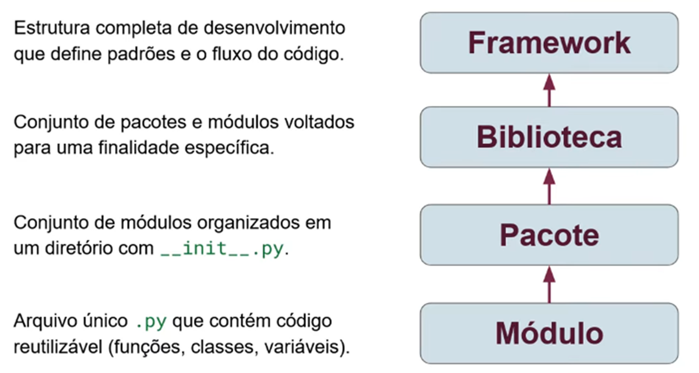

# Aplicando estratégias de diversificação em algoritmos evolutivos para problemas de Otimização em Engenharia Elétrica

Autor: Pedro Victor Rodrigues Veras
Prof. Orientador: Rainer Zanghi
Departamento de Engenharia Elétrica / Escola de Engenharia / LMSE
Universidade Federal Fluminense (UFF)  Programa de Iniciação Científica (PIBIC)

---

## Sumário

1) Introdução
2) Metodologia
3) Fundamentação Teórica
4) Arquitetura do Software
5) Resultados
6) Conclusões

---

## MOTIVAÇÃO

Esta pesquisa científica utiliza modelagem matemática e meta-heurísticas baseadas em processos bioinspirados, como a seleção natural, usando apenas a linguagem de programação Python para otimizar o agendamento de intervenções e operações em Sistemas Elétricos de Potência (SEP). O Software utiliza algoritmos evolutivos com DEAP e análise de contingências com Pandapower. O projeto é de código aberto e busca colaboradores para sua documentação online.

## Repositorio no Github

- **Repopulation-With-Elite-Set (UFF)**

---

## Metodologia em 4 etapas

1) Estudo Bibliográfico do caso de Agendamento Ótimo no SEP

- Revisão de conceitos fundamentais para anaĺise de Sistemas Elétricos de Potência (SEP) com algoritmos evolutivos e Pandapower

1) Elaboração de um novo algoritimo de otimização usando Algoritimo Evolutivo

- Definição de váriaveis de decisão, restrições e função objetivo do problema

1) Implementação do código em Python e Simulações de cenários

- Uso apenas da linguagem Python usando as bibliotecas: DEAP, Pandas, PandaPower e Pyside6

1) Testes de validação

- Testes de otimização em Redes IEEE 14, 30, 118 e SIN 45

---

## Arquitetura de um Software para Desktop usando Python

Launcher Qt 6 - PySide 6
Configuração de parâmetros do Algoritmo Genético e a quantidade de execuções das simulações pré definidas

Backend Python
Uso separado da camada de negocios com as bibliotecas PandaPower, Pandas, Streamlit, DEAP em arquitetura MVC

Dashboard Streamlit
Análise de resultados com mais de “100 execuções e 100 gerações”

---

## Diferenças entre Framework e uma Bibliteca

---

### Falas de Pedro Victor para Apresentação no ONS (27/05)

*Como você terá doutores na plateia, recomendo usar esta estrutura baseada nas fontes:*

1. **Fundamentação (Baseada na Tese 4):** Explique a **Epistasia** do problema de agendamento (como a mudança de um horário afeta todo o sistema) e como a **Estratégia RCE** resolve isso melhor que um AG simples.

2. **Inovação Técnica (Seu Framework):** Mostre como o uso de **Python + Pandapower + Tabelas Hash** permite realizar em minutos o que antes levava horas em simuladores tradicionais.

3. **Resultados em Redes Reais:** Apresente os resultados dos sistemas IEEE 118 e, principalmente, do **SIN 45**, que simula o subsistema Sul-Sudeste, provando a aplicabilidade prática no ONS.

4. **Integração Futura:** Finalize mencionando a capacidade de leitura de arquivos **.pwf** para integrar com o anaRede e o Organon.

---

### Funcionalidades Principais do Framework

- Algoritmo de Otimização: Implementação de Algoritmo Genético (AG) focado no problema de agendamento, utilizando a biblioteca DEAP.
- Estratégia de Diversificação: Inclui a técnica RCE (Repopulação Conjunto Elite) para melhorar a qualidade e a diversidade das soluções encontradas.
- Simulação de Redes Elétricas: Utiliza Pandapower para modelar as redes (IEEE 14, 30, 118 e SIN 45) e calcular o fluxo de potência, que serve como a "função objetivo" (fitness) do AG.
- Interface Gráfica (Desktop): Um Launcher completo em PySide6 (Qt) para configurar todos os parâmetros do AG, definir múltiplas execuções e acompanhar os logs em tempo real.
- Dashboard Web Interativo: Um painel de análise de resultados em Streamlit para visualizar graficamente a convergência do algoritmo, comparar execuções e explorar as soluções finais.

---

## fundamentação teórica

(as teses de mestrado e doutorado do Professor Rainer Zanghi) até a sua implementação tecnológica moderna (o framework em Python com DEAP, Pandapower, PySide6 e Streamlit).

### 1. A Evolução Científica do Problema (As Teses de Rainer)

As teses do Professor Rainer fornecem o "porquê" matemático e a validação metodológica:

- **Mestrado (2011):** Estabeleceu a base para tratar o agendamento de intervenções como um problema de **otimização combinatória**, utilizando Algoritmos Genéticos (AG) para lidar com restrições operativas simultâneas em sistemas IEEE 14 e 30 barras.
- **Doutorado (2016):** Foi onde surgiu o "pulo do gato" da diversificação. Ele introduziu a **Repopulação com Conjunto Elite (RCE)** e o **Critério de Unicidade**. O grande diferencial aqui foi a inclusão da **análise dinâmica (estabilidade transitória)** na função de aptidão, avaliando o comportamento do ângulo do rotor das máquinas frente a contingências durante as intervenções.

### 2. O Framework Tecnológico (Seu Artigo PIBIC e TCC)

Você transpôs essa teoria para uma stack de tecnologia de ponta, tornando-a uma ferramenta operativa:

- **Framework POO e DEAP:** Você organizou a lógica em classes como `Setup`, `AlgoritimoEvolutivoRCE` e `RedeEletricaPandaPower`, o que facilita a escalabilidade e manutenção do código.
- **Eficiência via Big Data (Tabela Hash):** Para resolver o problema do alto custo computacional citado nas teses de Rainer, você implementou **tabelas hash**. Isso evita o recálculo de fluxos de potência para cenários já visitados, reduzindo drasticamente o tempo de execução.
- **Validação com Rastrigin:** O uso dessa função benchmark prova que seu algoritmo consegue escapar de múltiplos mínimos locais em espaços de busca altamente complexos e multimodais.

---

### 3. Soluções Desktop e Web (PySide6 e Streamlit)

Este é o ponto que mais interessará à gerência PLC, pois demonstra a **usabilidade** da ferramenta:

- **Launcher PySide6:** Permite que um engenheiro configure parâmetros do AG e dispare baterias de testes sem precisar editar scripts Python diretamente.
- **Dashboard Streamlit:** Transforma os resultados brutos da otimização em visualizações analíticas (fitness médio, melhor indivíduo, violações por cenário), permitindo uma tomada de decisão rápida e baseada em dados.

---

## Classe RedeEletricaPandaPower e Casos de Uso

### Casos de Uso na funcao_objetivo_IEEE14 como função Objetivo

A função funcao_objetivo_IEEE14 usa a classe RedeEletricaPandaPower para simular e avaliar o desempenho de um agendamento de desligamentos na rede IEEE 14 barras.

O processo resume-se a:

- Inicialização: É criada uma instância da classe RedeEletricaPandaPower, carregando a rede IEEE 14 barras.
- Configuração: São definidos os pesos para as violações de fitness e carregados os dados de agendamento e contingência.
- Avaliação de Cenários: A função avalia_cenarios é utilizada para gerar uma matriz de cenários, considerando os horários de início e duração dos desligamentos e os perfis de carregamento.
- Simulação: Para cada cenário, o fluxo de carga é executado com executar_fluxo_de_carga. As cargas são ajustadas e os elementos da rede são desligados/religados conforme o cenário.
- Cálculo de Fitness: As violações são calculadas com calcular_violacoes_fitness, e o fitness do cenário é determinado com base nos pesos atribuídos.
Agregação de Resultados: Os valores de fitness de todos os cenários são somados para obter o fitness final do agendamento.

### Por que o fluxo de potência "não converge"?

Isto é um comportamento esperado e correto. A não convergência do fluxo de potência é um problema clássico ao simular múltiplas falhas na rede (N-k).

Isso geralmente acontece quando um cenário de operação (um agendamento de manutenção + uma contingência) leva a uma condição fisicamente instável ou impossível na rede, como:

- Colapso de Tensão: As tensões em algumas barras caem para níveis tão baixos que o sistema "apaga".
- Sobrecargas Extremas: Linhas ou transformadores sobrecarregados.
- Ilhamento: A rede divide-se em "ilhas" e uma delas fica sem geração própria para se sustentar.

O  algoritmo de otimização desenvolvido penaliza esses indivíduos, atribuindo-lhes um fitness muito alto (penalidade por não atendimento à demanda), garantindo que o AG aprenda a evitá-los.

## Métodos Principais da Classe

- carregar_redes_padrao(): Carrega uma rede padrão do Pandapower (ex: "case14").
- validar_dados(): Valida os DataFrames de agendamento e contingência.
- hashtableindex(): Calcula o índice da tabela hash para um cenário (evita recálculo).
- calcular_violacoes_fitness(): Calcula as violações de tensão e carregamento (o fitness).
- calcular_perfil(): Determina o perfil de carregamento (leve, médio, pesado).
- avalia_cenarios(): Gera a matriz de cenários de operação.
- executar_fluxo_de_carga(): Executa o runpp do Pandapower.
- ajustar_cargas(): Ajusta as cargas da rede conforme o perfil.
- desligar_elementos_agendamento(): Desliga elementos com base no agendamento.
- desligar_contingencia(): Desliga um elemento para simular uma contingência.
- religar_todos_os_ramos_agendamento(): Limpa a rede para o próximo cenário.

---

## 🧪  Métodos Numéricos, Sympy e Documentação Científica

### Equações Diferenciais com Sympy

Você pode usar o Sympy para resolver analiticamente as equações que regem os sistemas elétricos do projeto **Repopulation (UFF)**.

- **Exemplo:** Definir variáveis simbólicas para tensão ($V$) e corrente ($I$) e resolver as equações diferenciais de fluxo de carga.
- **Workflow:** Sympy (Solução Simbólica) -> Lambdify -> Numpy (Solução Numérica).

### Jupyter Notebooks e Quarto.md

O **Quarto (.qmd)** é a evolução do Jupyter para relatórios técnicos.

- **Por que usar:** Permite misturar Python, equações em LaTeX ($E=mc^2$) e textos explicativos de forma muito superior ao Markdown comum.
- **Aplicação:** Crie um arquivo `analise_redes.qmd` dentro do projeto `Repopulation` para gerar PDFs acadêmicos automáticos.

---

## 🚀  Roadmap de Projetos Avançados

### Para Python

1. **Solver de EDOs Universal:** Um sistema que recebe uma equação diferencial via Sympy e gera um dashboard interativo (Streamlit ou Flet) com a solução numérica e o gráfico de fases.

2. **Agente de IA Matemático:** Integrar o `Pikachu-API` com um agente que utiliza Sympy para verificar cálculos simbólicos enviados pelo usuário.

### Para JavaScript

1. **Visualizador de Campos Vetoriais:** Usar **Three.js** para visualizar fluxos de potência em 3D no dashboard do ONS.

2. **Engine de Simulação em Tempo Real:** Criar uma UI em React que simula o comportamento de um PLC (Programmable Logic Controller) usando Web Workers para os cálculos.

## 🛠️ Próximos Passos Sugeridos

- **Fase 1:** Migrar a documentação do projeto da UFF para **Quarto.md**.
- **Fase 2:** Implementar testes unitários (TDD) no módulo de extração do `Palkia`.
- **Fase 3:** Refatorar o `Pikachu-API` usando Injeção de Dependência (SOLID).

---

## Resultados AG - DEAP (2024)

---

## Resultados Otimização de Agendamento Ótimo em Redes Elétricas (2025)

---

## Resultados, Conclusões e Discussões

1) Ferramenta para análise: Framework opensource que utiliza otimização com minimização como solução para estudos de Sistemas Elétricos de Potencia

2) Eficiencia Computacional: Utilizar subprocessos em python em paralelo com uso de uma tabela hash reduziram o tempo ed cáculo de Fluxo de Potencia que utiliza o método de Newton-Raphson

3) Simulações: Testes em sistemas IEEE 13, 30, 57, 118 barras e caso de uso SIN 45 RJ/SP

---

## Trabahos Futuros

- Escabilidade do Sistema Desktop: Casos de SEP mais complexos com entrada de arquivos .PWF e .dat

- Utilizar outros algoritimos de otimização para programação linear para comparar os resultados com uma solução otima.

- Inclusão de outras restrições operativas realizadas no ONS como estabilidade e curto circuito.

---

## FIM
