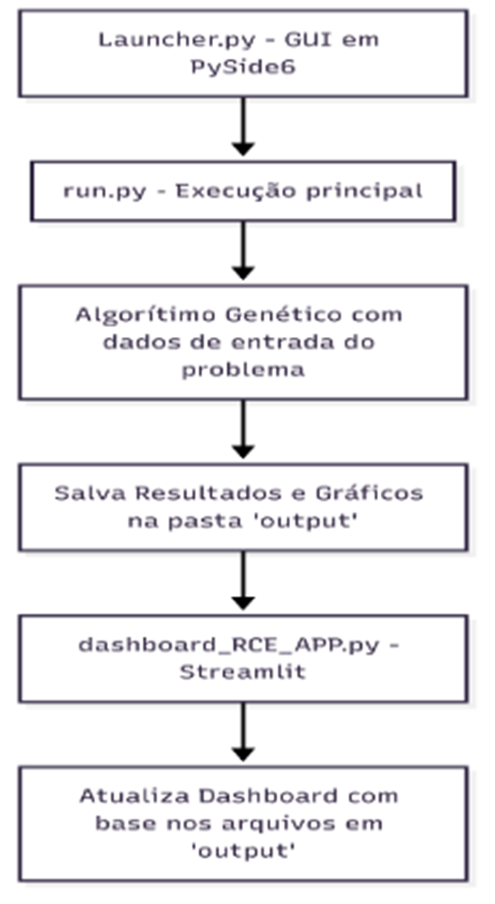

# Aplicando estratégias de diversificação em algoritmos evolutivos para problemas de Otimização em Engenharia Elétrica

Autor: Pedro Victor Rodrigues Veras
Prof. Orientador: Rainer Zanghi
Departamento de Engenharia Elétrica / Escola de Engenharia / LMSE
Universidade Federal Fluminense (UFF)  Programa de Iniciação Científica (PIBIC)

---

## Sumário

1) Introdução
2) Metodologia
3) Fundamentação Teórica e Levantamento Bibliográfico para estudo do Caso de Agendamento
  3.1) Consolidação dos Conceitos e Elaboração do Algoritmo
  3.2)  Implementação e Simulação
  3.3) Arquitetura e ferramentas
  3.4 Exemplo de implementação de uma função objetivo para um SEP
  3.5) Caso de uso para o problema de agendamento ótimo da rede IEEE 14
  
4) Produção técnico científica
 4.1) Arquitetura do Software
5) Resultados
 5.1) Simulações do problema de agendamento ótimo na rede IEEE 14
 5.2) Simulações do problema de agendamento ótimo na rede IEEE 30
 5.3) Simulações do problema de agendamento ótimo na rede IEEE 118
 5.4) Simulações no SIN 45 (SP-RJ) como exemplo de controle de casos
 5.5) Passo a passo para utilização do Framework pelo Github
6) Conclusões
7) Referências bibliográficas

---

## MOTIVAÇÃO

 Esta pesquisa científica utiliza modelagem matemática e meta-heurísticas baseadas em processos bioinspirados, como a seleção natural, usando apenas a linguagem de programação Python para otimizar o agendamento de intervenções e operações em Sistemas Elétricos de Potência (SEP). O Software utiliza algoritmos evolutivos com DEAP e análise de contingências com Pandapower. O projeto é de código aberto e busca colaboradores para sua documentação online.

## Repositorio no Github

- **Repopulation-With-Elite-Set (UFF)**

---

## Metodologia em 4 etapas

1) Estudo Bibliográfico do caso de Agendamento Ótimo no SEP
2) Revisão de conceitos fundamentais para anaĺise de Sistemas Elétricos de Potência (SEP) com algoritmos evolutivos e Pandapower
3) Elaboração de um novo algoritimo de otimização usando Algoritimo Evolutivo
4) Definição de váriaveis de decisão, restrições e função objetivo do problema

5) Implementação do código em Python e Simulações de cenários

- Uso apenas da linguagem Python usando as bibliotecas: DEAP, Pandas, PandaPower e Pyside6

1) Testes de validação

- Testes de otimização em Redes IEEE 14, 30, 118 e SIN 45

---

## Slide 1 — Capa

Aplicando estratégias de diversificação em algoritmos evolutivos para problemas de Otimização em Engenharia Elétrica

### Linha de Pesquisa

- Sistemas Elétricos de Potência (SEP)
- Metaheurísticas
- Algoritmos Evolutivos
- Otimização de Agendamento
- Planejamento da Operação

### Tecnologias

- Python
- DEAP
- Pandapower
- Pandas
- PySide6
- Streamlit

### Legenda da imagem

**Figura 1 — Arquitetura geral do framework de otimização aplicado ao SEP.**

> Inserir imagem:

- Fluxograma do framework
- AG + Pandapower + Dashboard
- Arquitetura do sistema

---

## Slide 2 — Motivação

## Contexto Operativo

- O Sistema Interligado Nacional (SIN) possui alta complexidade operacional.
- Desligamentos programados alteram a topologia da rede.
- Contingências simultâneas podem gerar:

  - Sobrecargas
  - Colapso de tensão
  - Corte de carga
  - Ilhamento

## Problema

O operador precisa:

- Minimizar riscos operativos
- Atender restrições elétricas
- Respeitar prioridades de manutenção
- Garantir segurança operativa

---

## Arquitetura de um Software para Desktop usando Python

Launcher Qt 6 - PySide 6
Configuração de parâmetros do Algoritmo Genético e a quantidade de execuções das simulações pré definidas

Backend Python
Uso separado da camada de negocios com as bibliotecas PandaPower, Pandas, Streamlit, DEAP em arquitetura MVC

Dashboard Streamlit
Análise de resultados com mais de “100 execuções e 100 gerações”

---

## Desafio Computacional

O problema possui:

- Espaço combinatório explosivo
- Alta epistasia
- Função objetivo não linear
- Alto custo computacional

Legenda da imagem

**Figura 2 — Exemplo de múltiplos cenários operativos no agendamento de intervenções.**

> Inserir imagem:

- Figura 4.3 da tese de doutorado
- Cenários operativos

---

## Slide 3 — Fundamentação Teórica

## Metaheurísticas e Algoritmos Evolutivos

- Processo Estocatico, problema classico de programação linear para otimização

## Algoritmos Genéticos

Inspirados em:

- Seleção natural
- Mutação
- Cruzamento
- Evolução populacional

## Estratégia RCE

### Repopulation-With-Elite-Set

Objetivos:

- Evitar convergência prematura
- Preservar diversidade
- Melhorar exploração do espaço de busca
- Intensificar regiões promissoras

## Conceitos importantes

- Epistasia
- Diversificação
- Intensificação
- Conjunto Elite
- Critério de Unicidade

 Legenda da imagem

**Figura 3 — Migração de indivíduos do conjunto elite durante repopulações da estratégia RCE.**

> Inserir imagem:

- Figura 4.6 da tese de doutorado

---

## Slide 4 — Formulação Matemática

## Modelagem Matemática para o algoritmo de otimização

## Variáveis de decisão

Cada gene representa:

- Horário inicial de desligamento
- Duração da intervenção
- Cenário operativo

## Função Objetivo

Minimizar:

[
Fitness = \sum_{cenários} \left(
w_v V_{violação}
+
w_f F_{violação}
+
w_c C_{corte}
\right)
]

Onde:

- (V_{violação}) → violações de tensão
- (F_{violação}) → sobrecarga em linhas/transformadores
- (C_{corte}) → penalidade por não atendimento

## Restrições

- Limites operativos
- Segurança N-1
- Limites de tensão
- Limites térmicos
- Atendimento à demanda

 Legenda da imagem

**Figura 4 — Representação genética do cromossomo de agendamento.**

> Inserir imagem:

- Figura 4.4 da tese de doutorado

---

## Slide 5 — Arquitetura do Framework

## Framework de Otimização

## Estrutura Geral

### Núcleo Matemático

- DEAP
- Algoritmos Evolutivos
- Estratégia RCE

### Simulação Elétrica

- Pandapower
- Fluxo de potência AC
- Contingências N-k

### Interface Desktop

- PySide6 (Qt)

### Dashboard Analítico

- Streamlit

## Diferencial

O framework transforma:

### Pesquisa acadêmica → ferramenta operativa

 Legenda da imagem

**Figura 5 — Arquitetura modular do framework desenvolvido em Python.**

> Inserir imagem:

- Arquitetura própria do projeto
- Launcher + núcleo + dashboard

---

## Slide 6 — Classe RedeEletricaPandaPower

Classe RedeEletricaPandaPower

## Responsabilidades

- Carregamento da rede
- Simulação elétrica
- Avaliação de cenários
- Controle de contingências
- Cálculo de fitness

## Principais Métodos

| Método                       | Função                  |
| ---------------------------- | ----------------------- |
| carregar_redes_padrao()      | Carrega rede IEEE       |
| avalia_cenarios()            | Gera matriz de cenários |
| executar_fluxo_de_carga()    | Executa runpp           |
| calcular_violacoes_fitness() | Avalia violações        |
| hashtableindex()             | Evita recálculos        |

## Otimização Computacional

Uso de:

- Hashtable
- Paralelismo
- Cache de cenários

Legenda da imagem

**Figura 6 — Fluxo de execução da classe RedeEletricaPandaPower.**

> Inserir imagem:

- Fluxograma interno da classe

---

## Slide 7 — (OBS RAINER) Não Convergência do Fluxo

## Por que o fluxo não converge?

## Não convergência ≠ erro

É um comportamento esperado em cenários críticos.

## Possíveis causas

- Colapso de tensão
- Sobrecargas severas
- Instabilidade operacional
- Ilhamento elétrico

## Estratégia utilizada

O algoritmo:

- Penaliza cenários inviáveis
- Aumenta fitness do indivíduo
- Aprende regiões seguras da busca

## Resultado

O AG aprende automaticamente:

### quais combinações operativas devem ser evitadas

 Legenda da imagem

**Figura 7 — Exemplo de cenário não convergente em contingência N-k.**

> Inserir imagem:

- Fluxo divergente
- Colapso de tensão
- Curvas de tensão

---

## Slide 8 — Resultados

## Resultados Experimentais

## Sistemas testados

- IEEE 14
- IEEE 30
- IEEE 57
- IEEE 118
- SIN 45

## Resultados observados

- Redução de violações
- Melhor distribuição temporal
- Maior diversidade populacional
- Melhor convergência

## Ganhos computacionais

- Uso de Hashtable
- Paralelismo
- RCE

## Aplicabilidade

- Planejamento da operação
- Estudos de intervenção
- Apoio ao operador

 Legenda da imagem

**Figura 8 — Comparação entre agendamento solicitado e otimizado.**

> Inserir imagem:

Segundo UFCE[5], a partir de [6]:
“As metaheurísticas são um conjunto de conceitos os quais podem ser usados para
definir métodos heurísticos que podem ser aplicados a uma ampla gama de diferentes
problemas. Portanto, trata-se de um conjunto de regras que podem servir de base para o projeto
em modelagem computacional. Uma metaheurística pode ser escrito em um algoritmo modular

3

Universidade Federal Fluminense

que pode ser aplicado a diferentes problemas de otimização com poucas modificações a serem
realizadas na adaptação a um problema específico”
Em UFCE [5], encontram-se alguns conceitos importantes sobre metaheurísticas:
● Vizinhança de uma solução: São um conjunto de soluções próximas a uma solução específica,
uma solução (variáveis de decisão) se refere a um conjunto de soluções próximas que podem ser
alcançadas a partir da solução atual, e a metaheurística busca encontrar a solução ótima global,
que possui o valor mínimo (0.0 para Rastrigin), explorando essas vizinhanças.
● Problema de otimização: Como representar um problema, a cada solução viável, deve ser
relacionado um novo valor da função aptidão para minimização ou maximização.
● Solução vizinha: Pode ser uma alternativa próxima à solução atual, diferindo apenas por uma
modificação dos valores próximos da solução global.
● Perturbação: É o mecanismo que gera soluções vizinhas a partir da solução atual,
introduzindo pequenas alterações.
● Busca local: Explora sistematicamente as soluções vizinhas, guiada pela função objetivo, em
busca de uma solução melhor;
● Problemas com restrições: É possível implementar algoritmos com penalidade aplicada a cada
violação de restrições no valor da função objetivo.
As metaheurísticas, como ferramentas inteligentes de otimização, oferecem soluções de
problemas complexos que desafiam métodos tradicionais. Neste trabalho, é explorado o uso de
algoritmos evolutivos, uma classe de metaheurísticas, para construir um framework em Python, focado
em otimizar problemas aplicados em engenharia elétrica em problemas de minimização.
Em [7], onde foi utilizado Otimização por Enxame de Partículas para otimizar os parâmetros do
Compensador Série Síncrono Estático (CSSE) para melhor o limite de maximização de carregamento. O
algoritmo é motivado a partir do comportamento de um bando de pássaros ou um cardume de peixes em
busca de seu alimento. O movimento de cada indivíduo é influenciado pela velocidade anterior, pela
própria experiência de cada membro e pela experiência dos outros indivíduos. Cada indivíduo é
denominado uma partícula. Os parâmetros de um CSSE são otimizados para minimizar as perdas ativas
e reativas do sistema.
Já em [8], a otimização seno-cosseno é usada para projetar os parâmetros de um estabilizador de
sistema de potência para amortecer oscilações eletromecânicas em uma única máquina conectada a um
grande sistema de potência.
Além disso, também existem artigos que comparam meta-heurísticas populacionais diferentes
sendo usadas para o mesmo problema como em [9] onde são comparados algoritmos como Enxame de
Partículas e Otimização Jaya, além da construção de um novo algoritmo que usa metaheurísticas

4

Universidade Federal Fluminense

populacionais, para ser aplicado na previsão da produção de energia de um sistema de energia solar
fotovoltaica e de turbina eólica.

- Tabelas 5.24 a 5.32
- Diagramas de tempo

---

## Slide 9 — Dashboard Streamlit

Dashboard Analítico

## Funcionalidades

- Evolução do fitness
- Melhor indivíduo
- Comparação entre execuções
- Estatísticas do AG
- Visualização operacional

## Benefícios

- Tomada de decisão rápida
- Análise visual
- Interação com resultados

 Legenda da imagem

**Figura 9 — Dashboard Streamlit para análise das execuções do algoritmo evolutivo.**

> Inserir imagem:

- Dashboard real do projeto

---

## Slide 10 — Trabalhos Futuros

Trabalhos Futuros

## Integrações

- Leitura de arquivos .pwf
- Integração com AnaRede
- Integração com Organon

## Inteligência Artificial

- Agentes inteligentes
- IA para apoio operacional
- Aprendizado por reforço

## Visualização Avançada

- Redes 3D
- Three.js
- Monitoramento em tempo real

## Pesquisa Científica

- Estabilidade transitória
- Métodos híbridos
- Sympy + Quarto.md
- EDOs em SEP

Legenda da imagem

**Figura 10 — Roadmap tecnológico do framework de otimização para aplicações futuras.**

> Inserir imagem:

- Roadmap visual
- Ecossistema tecnológico

---

## Slide 11 — Conclusões

## Conclusões e resultados

![[Pasted image 20260526093812.png]]

![[Pasted image 20260526093826.png]]

## Discussões e trabalhos futuros

## O trabalho demonstrou que

- Algoritmos evolutivos são adequados para o problema de agendamento no SEP.
- A estratégia RCE melhora diversidade e qualidade das soluções.
- O Pandapower permite modelagem eficiente de redes elétricas.
- O framework possui potencial real de aplicação no ONS.

> Inserir imagem:

- SIN
- linhas de transmissão
- visualização energética do Brasil

---

## Contribuições Científicas

- Framework open source
- Integração otimização + SEP
- Ferramenta escalável
- Base para futuras pesquisas

---

## Slide 11 - referencias

#### 7)  REFERÊNCIAS BIBLIOGRÁFICAS

[1]ZANGHI, R.  “Meta-heurísticas aplicadas ao Agendamento de Intervenções em Redes Elétricas”, Tese de Doutorado, Instituto de Computação, Universidade Federal Fluminense, [pdf]. Disponível em: <http://www.ic.uff.br/PosGraduacao/frontendtesesdissertacoes/download.php?id=741.pdf&tipo=trabalho> , [Acessado em novembro de 2024], 2016.

[2] SILVA, L. G. “Agendamento de intervenções em redes elétricas considerando a otimização da segurança sistêmica”,  Dissertação de mestrado, Engenharia Elétrica e de Telecomunicações da Universidade Federal Fluminense, 2022.

[3] ONS (Operador Nacional do Sistema Elétrico)., Procedimentos de Rede, Submódulo 10.14, rev 2016.12 “Requisitos operacionais para os centros de operação, subestações e usinas da rede de operação”, Rio de Janeiro: ONS,  2016.

[4] THURNER, L. et al., "Pandapower—An Open-Source Python Tool for Convenient Modeling, Analysis, and Optimization of Electric Power Systems," in IEEE Transactions on Power Systems, vol. 33, no. 6, pp. 6510-6521, Nov. 2018, doi: 10.1109/TPWRS.2018.2829021.

[5] RIVERA, R.; ESPOSITO, A.S.; TEIXEIRA, I. Redes elétricas inteligentes (smart grid): oportunidade para adensamento produtivo e tecnológico local. Disponível em: [https://web.bndes.gov.br/bib/jspui/bitstream/1408/2927/1/RB%2040%20Redes%20el%C3%A9tricas%20inteligentes_P.pdf](https://web.bndes.gov.br/bib/jspui/bitstream/1408/2927/1/RB%2040%20Redes%20el%C3%A9tricas%20inteligentes_P.pdf)

[6] VERAS, P. V. R; ROCHA, D. M F; ZANGHI, R.  Estratégias de diversificação em meta-heurísticas aplicadas a problemas de otimização em engenharia elétrica, Revista PIBIC UFF : Anais do Seminário 2024, 2024. ISSN 2317-4560

[7] ZANGHI, R.; SOUZA, J. C. S. de; FILHO, M. B. do C. Estratégias de diversificação para otimização da programação de intervenções em redes elétricas. Anais do 12o Congresso Brasileiro de Inteligência Computacional, ABRICOM, outubro 2015. Disponível em: <[https://doi.org/10.21528%2Fcbic2015-034](https://doi.org/10.21528%2Fcbic2015-034)>.

[8] GAMMA, R; HELM, R; JOHNSON, R; VLISSIDES, J. “Design Patterns: Elements of Reusable Object-Oriented Software” 1994

## Slide 12 — Fim

## Obrigado

Pedro Victor Rodrigues Veras
Engenharia Elétrica — UFF
