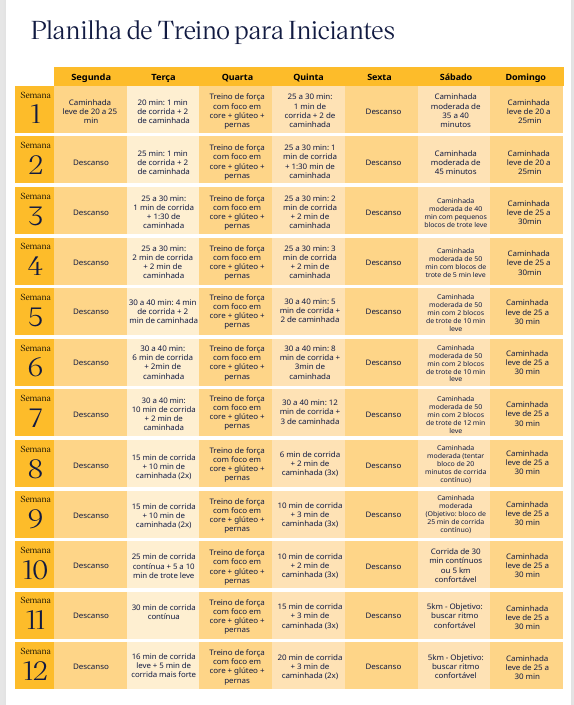

# AtletasONS: preparem-se para as corridas e evoluam com mais segurança e constância

Com provas em Recife e no Rio de Janeiro se aproximando, confira dicas para melhorar seu desempenho e aproveitar melhor cada treino
19/05/2026
As corridas de Recife e Rio estão chegando e o ritmo já aumentou entre os #AtletasONS. Seja para quem já está em treinamento ou para quem decidiu começar agora, o mais importante é dar o primeiro passo e manter a regularidade, pois é ela que faz a diferença na evolução e na performance.

Mais do que o resultado no dia da prova, a preparação ao longo das semanas é essencial para correr com mais segurança, evitar lesões e ganhar resistência. Com alguns cuidados simples, é possível melhorar o desempenho e aproveitar melhor essa experiência.

## Dicas iniciais

- Constância é mais importante do que performance: mais do que velocidade, o principal é manter regularidade e disciplina nos treinos;

- Hidratação e alimentação: o que você consome impacta diretamente seu desempenho e a recuperação do corpo;

- Alongamento e aquecimento: aqueça antes de correr e deixe o alongamento para o pós-treino, ajudando na recuperação muscular;

- Equipamentos: não é preciso alto investimento, mas vale escolher um tênis adequado e roupas confortáveis para a atividade.

## Para ir além nos treinos

A cartilha de corrida preparada pela Marsh, parceira do ONS em saúde e qualidade de vida, reúne orientações práticas, planos de treino e recomendações para quem quer evoluir com segurança, independentemente do nível de experiência. Confira aqui.

Próximas corridas do ONS

- Recife (REC): Corrida do Recife Night Run, em 23/05

- Rio de Janeiro (RIO): Corrida do Circuito das Estações, em 31/05

Bora manter o ritmo e aproveitar cada etapa dessa jornada, #AtletasONS.
