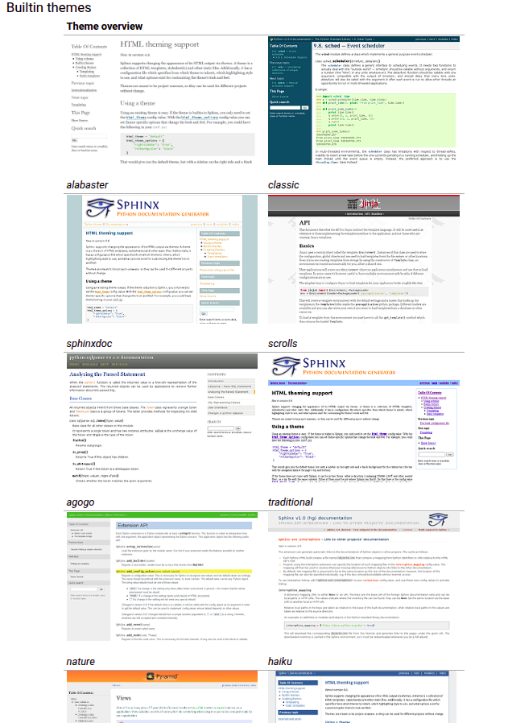

# Como usar Sphinx e Markdown para documentação em Projetos Python

Este guia fornece as instruções básicas para compilar e visualizar a documentação do projeto.

## Temas disponíveis (Aceitando sugestões)




## Comandos Principais

| Comando | Finalidade |
| --- | --- |
| `pip install sphinx myst-parser` | Instala o Sphinx e a extensão para suporte a Markdown. |
| `sphinx-quickstart` | Inicia um novo projeto Sphinx. |
| `make html` | Compila os arquivos da documentação para o formato HTML. |

## Como Visualizar a Documentação

sphinx-quickstart docs-sphinx -p "Repopulation-With-Elite-Set" -a "Pedro" -r  "0.1" -l pt_BR --no-sep     

Para gerar e visualizar a documentação em seu navegador, siga os passos abaixo:

1.  Abra um terminal na raiz do projeto.
2.  Navegue até a pasta `docs-sphinx`:
    ```sh
    cd docs-sphinx
    ```
3.  Execute o comando `make html` para compilar os arquivos:
    ```sh
    make html
    ```
    Este comando irá gerar os arquivos HTML na pasta `docs-sphinx/_build/html`.

4.  Abra o arquivo `index.html` em seu navegador para ver a documentação:
    ```sh
    # No Linux
    xdg-open _build/html/index.html

    # No macOS
    open _build/html/index.html

    # No Windows
    start _build/html/index.html
    ```