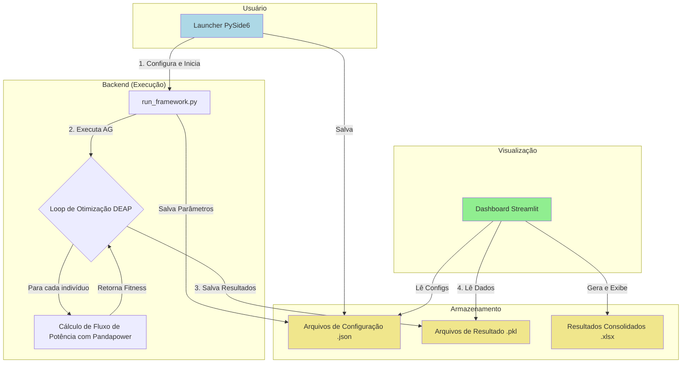
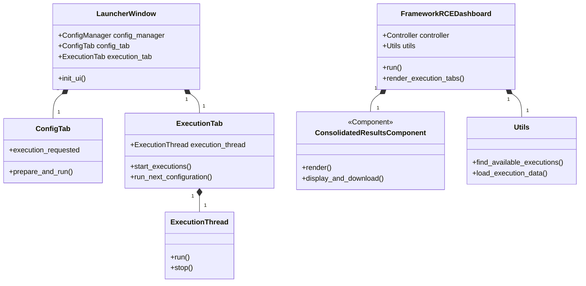

# Otimização de Fluxo de Potência em Redes IEEE com Algoritmos Genéticos

**Autor:** Pedro Victor Veras
**Colaboração:** Dr. Rainer Zanghi
**Instituição:** Universidade Federal Fluminense (UFF) - PIBIC 2024/2025

## 1. Resumo

Este projeto apresenta um framework completo para a otimização do fluxo de potência em redes elétricas, com foco em casos de teste do IEEE, como o sistema de 14 barras. A solução utiliza um Algoritmo Genético (AG), implementado com a biblioteca **DEAP**, para encontrar configurações ótimas que minimizem perdas ou custos operacionais. O cálculo do fluxo de potência, que serve como função de avaliação (fitness) para o AG, é realizado pela biblioteca **Pandapower**. O sistema é encapsulado por uma interface de configuração desenvolvida em **PySide6** e um dashboard de visualização de resultados em **Streamlit**, proporcionando um ciclo completo de experimentação, desde a configuração dos parâmetros até a análise interativa dos resultados.

## 2. Tecnologias Utilizadas

- **Linguagem:** Python 3
- **Algoritmo Genético:** DEAP (Distributed Evolutionary Algorithms in Python)
- **Simulação de Redes Elétricas:** Pandapower
- **Interface de Configuração (Launcher):** PySide6
- **Dashboard de Visualização:** Streamlit
- **Manipulação de Dados:** Pandas & NumPy
- **Empacotamento e Execução:** Subprocess, Pathlib

## 3. Metodologia e Arquitetura

O framework foi projetado de forma modular para separar as responsabilidades de configuração, execução e visualização. O fluxo de trabalho é o seguinte:

1.  **Configuração:** O usuário utiliza o **Launcher (PySide6)** para definir os parâmetros do Algoritmo Genético (tamanho da população, taxa de mutação/crossover, número de gerações) e o número de execuções para cada cenário. As configurações podem ser fixas ou variar em um range de valores, permitindo a execução de baterias de testes complexas.
2.  **Execução:** O Launcher invoca o script principal do framework, que coordena o processo de otimização. Para cada configuração, o script executa o AG o número de vezes especificado.
3.  **Otimização (AG + Pandapower):**
    *   **Indivíduo:** Cada "indivíduo" na população do AG representa uma possível solução para a rede (ex: ajuste de taps de transformadores, despacho de geradores).
    *   **Função de Fitness:** Para cada indivíduo, o **Pandapower** é utilizado para rodar um cálculo de fluxo de potência. O resultado (ex: perdas totais na rede) é retornado como o valor de fitness. O objetivo do AG é minimizar esse valor.
    *   **Evolução:** O **DEAP** gerencia o ciclo evolucionário: seleção dos melhores indivíduos, aplicação de operadores de crossover e mutação para gerar novos descendentes e formação de uma nova população. O elitismo é empregado para garantir que as melhores soluções não sejam perdidas entre as gerações.
4.  **Armazenamento de Dados:** Ao final de cada execução, os resultados (melhor solução, fitness, estatísticas da evolução) são serializados em arquivos `.pkl`. Os parâmetros da configuração utilizada são salvos em arquivos `.json` para rastreabilidade.
5.  **Visualização:** O **Dashboard (Streamlit)** lê os arquivos de resultado (`.pkl` e `.json`), processa e consolida os dados, e exibe-os em uma interface interativa. O usuário pode navegar entre diferentes configurações e execuções, visualizar gráficos de convergência, analisar as soluções encontradas e comparar resultados em uma tabela consolidada.

### Fluxograma do Processo

### Diagrama de Classes (Simplificado)

## 4. Avaliação do Projeto

Avaliando este repositório como um projeto de software, a nota seria **7.5 de 10**.

### Pontos Fortes:

*   **Solução Completa (End-to-End):** O projeto vai além de um simples script de otimização. Ele oferece uma solução completa com interface de configuração, motor de processamento e dashboard de visualização, o que é excelente para a usabilidade e experimentação.
*   **Uso de Ferramentas Adequadas:** A escolha das bibliotecas é muito acertada. `Pandapower` e `DEAP` são padrões de indústria e academia para suas respectivas áreas. `Streamlit` e `PySide6` são ótimas escolhas para a prototipagem rápida de interfaces gráficas.
*   **Complexidade Abstraída:** O framework consegue lidar com uma bateria complexa de testes (múltiplas configurações e execuções) e apresenta os resultados de forma consolidada e interativa, abstraindo a complexidade do usuário final.
*   **Funcionalidade Robusta:** O sistema de abas aninhadas com a funcionalidade de "fixar" um componente é um recurso avançado e muito útil para a análise comparativa de resultados.

### Pontos a Melhorar:

*   **Organização e Estrutura de Arquivos:** A estrutura do repositório poderia ser mais limpa e padronizada. Há arquivos de backup, código em pastas como `caos/` e arquivos na raiz que poderiam estar em diretórios mais apropriados (como `src/` ou `scripts/`).
*   **Redundância de Código:** A presença de arquivos como `laucher.py` e `launcher_fixed.py`, além de múltiplos notebooks e backups, sugere uma necessidade de refatoração e um uso mais rigoroso de controle de versão (Git) para evitar duplicação.
*   **Testes Automatizados:** Embora existam arquivos de teste, a cobertura parece limitada. Um projeto desta complexidade se beneficiaria enormemente de uma suíte de testes unitários e de integração mais abrangente para garantir a confiabilidade das alterações e refatorações.
*   **Documentação Interna (Comentários):** O código em si possui poucos comentários, o que pode dificultar a manutenção ou a colaboração de novos desenvolvedores.

Em resumo, é um projeto funcionalmente impressionante e muito bem-sucedido em seu objetivo técnico. A nota é impactada principalmente por aspectos de engenharia de software que, se aprimorados, elevariam a qualidade, manutenibilidade e robustez do projeto a um nível ainda mais alto.
