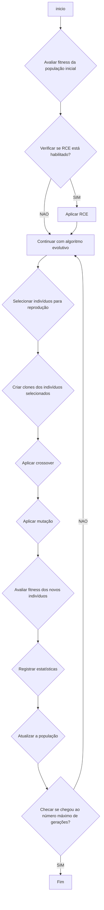

```mermaid
graph TD
A[inicio] --> B{Avaliar fitness da população inicial}
B --> C{Verificar se RCE está habilitado?}
C --> |SIM| D[Aplicar RCE]
C --> |NAO| E[Continuar com algoritmo evolutivo]
D --> E[Continuar com algoritmo evolutivo]
E --> F{Selecionar indivíduos para reprodução}
F --> G{Criar clones dos indivíduos selecionados}
G --> H{Aplicar crossover}
H --> I{Aplicar mutação}
I --> J{Avaliar fitness dos novos indivíduos}
J --> K{Registrar estatísticas}
K --> L{Atualizar a população}
L --> M{Checar se chegou ao número máximo de gerações?}
M --> |SIM| N[Fim]
M --> |NAO| E[Continuar com algoritmo evolutivo]

```
