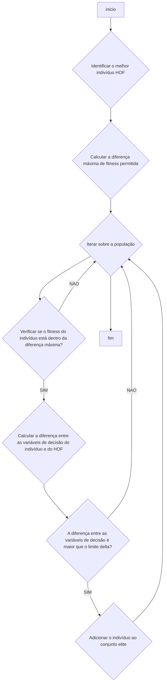

```mermaid
graph TD
A[inicio] --> B{Identificar o melhor indivíduo HOF}
B --> C{Calcular a diferença máxima de fitness permitida}
C --> D{Iterar sobre a população}
D --> E{Verificar se o fitness do indivíduo está dentro da diferença máxima?}
E --> |SIM| F{Calcular a diferença entre as variáveis de decisão do indivíduo e do HOF}
E --> |NAO| D
F --> G{A diferença entre as variáveis de decisão é maior que o limite delta?}
G --> |SIM| H{Adicionar o indivíduo ao conjunto elite}
G --> |NAO| D
H --> D
D --> I[fim]
```
