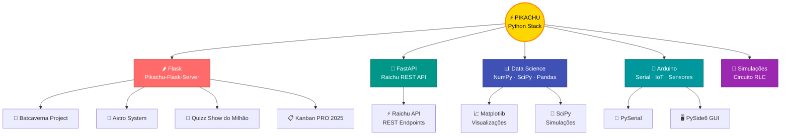
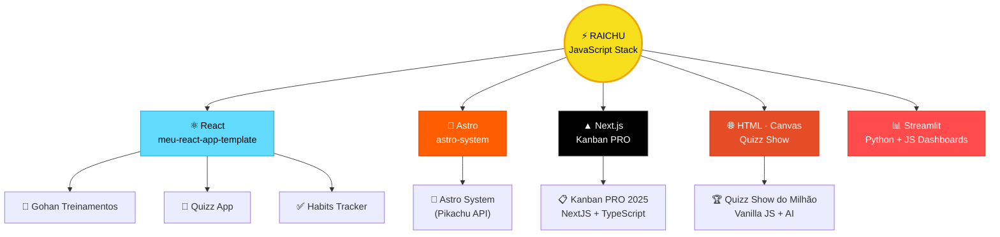
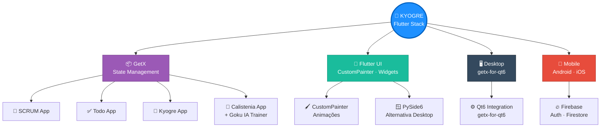
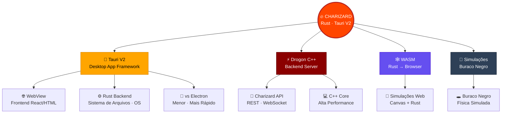
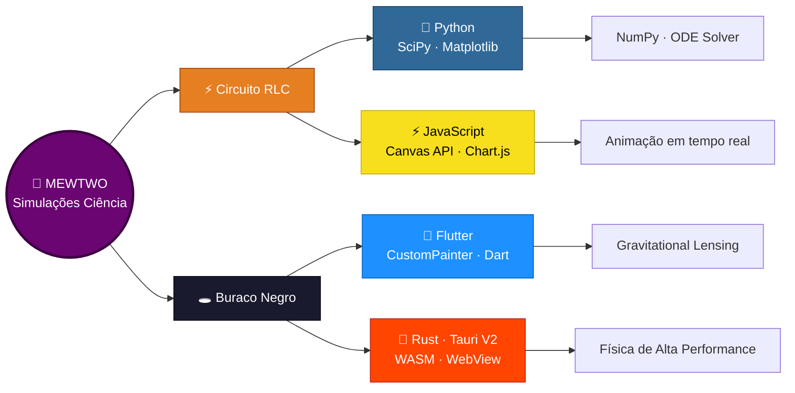

# 🚀 Pedro Victor — Projetos GitHub
> Dev Pleno · Engenharia Elétrica & Computação · Rio de Janeiro

---

## 📑 Índice
- [🐍 Python Stack — Pikachu](#python-stack)
- [⚡ JavaScript Stack — Raichu](#javascript-stack)
- [🦋 Flutter Stack — Kyogre](#flutter-stack)
- [🦀 Rust + Tauri Stack — Charizard](#rust-stack)
- [🔬 Simulações de Ciência](#simulacoes)
- [📦 Tabela de Repositórios](#tabela-repos)

---

## 📦 Tabela de Repositórios <a id="tabela-repos"></a>

| Pokémon | Stack | Repositório | Projeto Interno | Status |
|---------|-------|-------------|-----------------|--------|
| 🟡 **Pikachu** | Flask · Python | [Pikachu-Flask-Server][pikachu-repo] | [Batcaverna][batcaverna] · [Astro System][astro-system] · [Quizz Show][quizz] · [Kanban PRO][kanban] | ✅ Ativo |
| ⚡ **Raichu** | FastAPI · Python | [Raichu-FastAPI][raichu-repo] | Pikachu REST API | ✅ Ativo |
| 🔥 **Charizard** | Drogon · C++ | [Charizard-Drogon][charizard-repo] | Backend C++ | ✅ Ativo |
| 🌊 **Kyogre** | Flutter · GetX | [my-flutter-getx-app][kyogre-repo] | SCRUM · Todo · Kyogre | ✅ Ativo |
| 🥦 **Gohan** | React · Web | [Gohan-treinamentos-web-app][gohan-repo] | Treinamentos · Quizz · Habits | ✅ Ativo |
| ⚙️ **GetX Qt6** | Qt6 · Dart | [getx-for-qt6][qt6-repo] | Desktop App Qt6 | 🔧 Dev |
| 🔬 **Mewtwo** | Python · JS · Rust | — | [Circuito RLC][rlc] · [Buraco Negro][blackhole] | 🚧 Planejado |

---

<!-- ===================== VARIÁVEIS DE LINKS ===================== -->
[pikachu-repo]: https://github.com/PedroVic12/Pikachu-Flask-Server
[raichu-repo]: https://github.com/PedroVic12/Raichu-FastAPI
[charizard-repo]: https://github.com/PedroVic12/Charizard-Drogon
[kyogre-repo]: https://github.com/PedroVic12/my-flutter-getx-app
[gohan-repo]: https://github.com/PedroVic12/Gohan-treinamentos-web-app
[qt6-repo]: https://github.com/PedroVic12/getx-for-qt6

<!-- Sub-projetos Pikachu-Flask-Server -->
[batcaverna]: https://github.com/PedroVic12/Pikachu-Flask-Server/tree/main/batcaverna/batcaverna-project
[astro-system]: https://github.com/PedroVic12/Pikachu-Flask-Server/tree/main/pikachu-API/astro-system
[quizz]: https://github.com/PedroVic12/Pikachu-Flask-Server/blob/main/frontend/Quizz_App_For_Studying_With_UI/quizz_show_do_mihao_AI.html
[kanban]: https://github.com/PedroVic12/Pikachu-Flask-Server/tree/main/frontend/project_kanban_pro_2025

<!-- Simulações -->
[rlc]: #simulacoes
[blackhole]: #simulacoes

---

## 🐍 Python Stack — Pikachu <a id="python-stack"></a>
> **Core:** Flask · FastAPI · NumPy · SciPy · Matplotlib · Arduino Serial



---

## ⚡ JavaScript Stack — Raichu <a id="javascript-stack"></a>
> **Core:** React · Astro · Next.js · HTML Canvas · Vite



---

## 🦋 Flutter Stack — Kyogre <a id="flutter-stack"></a>
> **Core:** Flutter · Dart · GetX · CustomPainter · Firebase



---

## 🦀 Rust + Tauri Stack — Charizard <a id="rust-stack"></a>
> **Core:** Rust · Tauri V2 · C++ Drogon · WebView · WASM



---

## 🔬 Simulações de Ciência — Mewtwo <a id="simulacoes"></a>
> **Core:** Python · JavaScript · Rust · Flutter · Física Computacional



---

## 🗂️ Estrutura de Pastas — Pikachu Flask Server

```
GitHub/Pikachu-Flask-Server/
├── batcaverna/
│   └── batcaverna-project/          ← 🦇 Batcaverna Project
├── pikachu-API/
│   └── astro-system/                ← 🌌 Astro System
└── frontend/
    ├── Quizz_App_For_Studying_With_UI/
    │   └── quizz_show_do_mihao_AI.html  ← 🎯 Quizz Show do Milhão
    └── project_kanban_pro_2025/     ← 📋 Kanban PRO NextJS
```

---

*Gerado em 2026 · Pedro Victor · Engenharia Elétrica & Computação*
