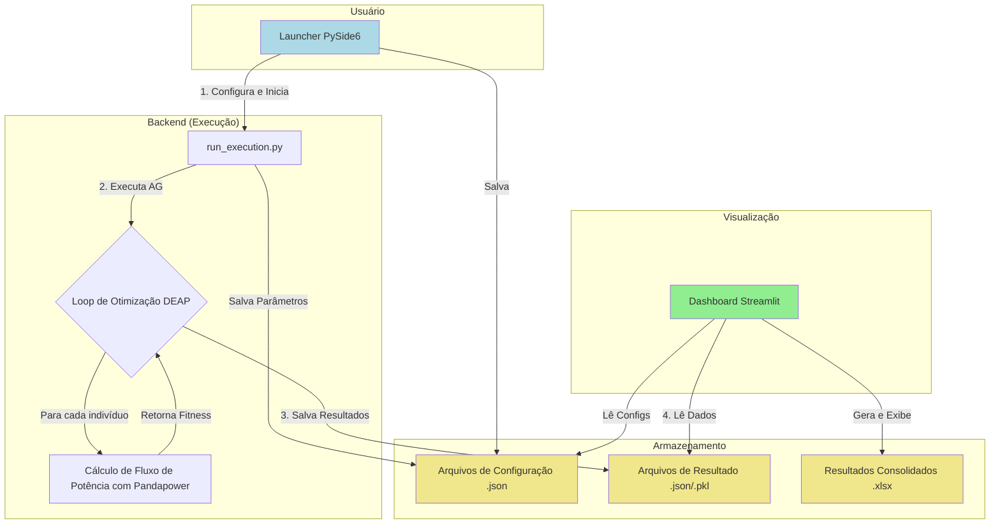

# Análise do Framework RCE para Otimização de Redes Elétricas

## 1. Introdução e Objetivo

Este documento detalha o funcionamento do framework **Repopulation-With-Elite-Set (RCE)**, uma solução de software completa projetada para a otimização do planejamento e agendamento de intervenções (manutenções) em redes elétricas de potência.

O objetivo central é encontrar um cronograma de manutenção ótimo que minimize os riscos operacionais (como sobrecargas e violações de tensão), garantindo que o sistema permaneça estável mesmo sob cenários de contingência (critério N-1).

Para alcançar isso, o projeto integra de forma coesa as seguintes tecnologias:

-   **Motor de Otimização:** Algoritmo Genético (AG) implementado com a biblioteca **DEAP**.
-   **Simulação de Rede:** Análise de fluxo de potência realizada com **Pandapower**, que serve como a função de fitness (avaliação) para o AG.
-   **Interface de Configuração:** Um launcher de desktop desenvolvido com **PySide6** para facilitar a configuração de múltiplos cenários e execuções.
-   **Dashboard de Análise:** Uma aplicação web interativa com **Streamlit** para visualização e análise detalhada dos resultados.

## 2. Arquitetura e Componentes Principais

O framework é construído sobre uma arquitetura modular que separa claramente as responsabilidades em três componentes principais:

1.  **Launcher (Frontend de Configuração):** Interface gráfica onde o usuário define os parâmetros do algoritmo genético (`params.json`) e as variações para a bateria de testes (`options.json`).
2.  **Motor de Execução (Backend):** Script principal (`run_execution.py`) que orquestra todo o processo de otimização. Ele lê as configurações, executa o algoritmo evolutivo e salva os resultados.
3.  **Dashboard (Frontend de Visualização):** Aplicação web que lê os dados gerados pela execução, consolida-os e apresenta gráficos, tabelas e estatísticas para análise.

O fluxo de dados entre esses componentes pode ser visualizado no diagrama abaixo:

## 3. Fluxo de Execução Passo a Passo

O processo completo, desde a configuração até a análise, segue os seguintes passos:

1.  **Configuração via Launcher:** O usuário utiliza a interface gráfica em PySide6 para definir os parâmetros da simulação. Isso inclui:
    *   **Parâmetros Fixos (`params.json`):** Configurações base do Algoritmo Genético (ex: tamanho do indivíduo `IND_SIZE`).
    *   **Parâmetros Variáveis (`options.json`):** Definição de múltiplos valores para parâmetros como `MUTACAO`, `CROSSOVER`, `POP_SIZE`, etc. O framework irá gerar e executar todas as combinações possíveis.
    *   **Repetições:** Número de vezes que cada configuração única será executada para garantir a robustez estatística.

2.  **Início da Execução:** Ao clicar em "Executar", o Launcher invoca o script `run_execution.py` em um processo separado, garantindo que a interface não trave.

3.  **Loop de Otimização (DEAP):** O script de execução inicia o processo do Algoritmo Genético.
    *   **Criação da População:** Uma população inicial de "indivíduos" é gerada. Cada indivíduo representa uma solução candidata para o problema (ex: um vetor com os horários de início para cada tarefa de manutenção).

4.  **Avaliação de Fitness (Função Objetivo):** Este é o coração do framework e o passo mais custoso computacionalmente. Para cada indivíduo da população, o sistema executa:
    *   **Análise de Cenários:** O agendamento proposto pelo indivíduo é traduzido em uma série de cenários de rede a serem testados, considerando os desligamentos programados, perfis de carga (leve, média, pesada) e contingências (falhas N-1).
    *   **Otimização com Tabela Hash (Memoização):** Antes de rodar uma simulação completa, o framework verifica se o cenário (uma combinação única de topologia e carga) já foi avaliado anteriormente. Se sim, o resultado (fitness) é lido diretamente de uma tabela hash, **evitando o recálculo custoso do fluxo de potência**. Esta etapa é crucial para a viabilidade computacional do projeto.
    *   **Simulação com Pandapower:** Se o cenário é inédito, o `Pandapower` é utilizado para modelar a rede elétrica e executar o cálculo de fluxo de potência.
    *   **Cálculo de Violações:** O resultado do fluxo de potência é analisado para verificar violações de limites operativos (tensão nas barras, carregamento de linhas e transformadores).
    *   **Cálculo do Fitness:** As violações são quantificadas, ponderadas por pesos pré-definidos e somadas para gerar um único valor de fitness que representa a "qualidade" da solução. O objetivo do AG é minimizar esse valor.

5.  **Evolução (DEAP):** Com o fitness de toda a população calculado, o DEAP aplica os operadores genéticos:
    *   **Seleção:** Indivíduos com melhor fitness são selecionados para a próxima geração.
    *   **Crossover:** Partes de dois indivíduos pais são combinadas para gerar novos descendentes.
    *   **Mutação:** Pequenas alterações aleatórias são introduzidas nos indivíduos para garantir a diversidade genética.

6.  **Repopulation with Elite Set (RCE):** O framework utiliza a técnica de RCE, uma forma avançada de elitismo. Um conjunto das melhores soluções já encontradas é mantido e usado para repovoar uma parte da população periodicamente, evitando a convergência prematura para ótimos locais.

7.  **Conclusão e Armazenamento:** O ciclo de evolução se repete pelo número de gerações definido. Ao final, a melhor solução encontrada é registrada. Os resultados detalhados de cada execução (logbook da evolução, parâmetros, melhor indivíduo) são salvos em arquivos `json` e `pkl` no diretório `src/output/`.

8.  **Consolidação e Visualização:**
    *   Um script de consolidação (`consolidar_resultados.py`) pode ser executado para ler todos os arquivos de resultado individuais e criar uma única planilha `.xlsx` com o resumo de toda a bateria de testes.
    *   O **Dashboard Streamlit** lê tanto os arquivos detalhados quanto o consolidado para apresentar os dados de forma interativa, com gráficos de convergência, tabelas comparativas e detalhes de cada execução.

## 4. Principais Conceitos e Inovações

-   **Solução End-to-End:** O framework cobre todo o ciclo de vida da experimentação, da configuração à análise de resultados, abstraindo a complexidade do usuário.
-   **Performance via Memoização:** O uso de uma **tabela hash** para armazenar resultados de cenários já calculados é a inovação chave que torna a análise de um vasto número de contingências computacionalmente viável. Os resultados mostram uma redução de até 99% no número de simulações pesadas.
-   **Flexibilidade de Configuração:** A separação de parâmetros fixos (`params.json`) e variáveis (`options.json`) permite a criação de baterias de testes complexas e sistemáticas de forma simples e rápida através do Launcher.
-   **Análise de Contingência (N-1):** A função de fitness não é uma simples avaliação, mas sim uma robusta análise de segurança que simula falhas em componentes da rede para garantir que as soluções encontradas sejam seguras e confiáveis para a operação real.
